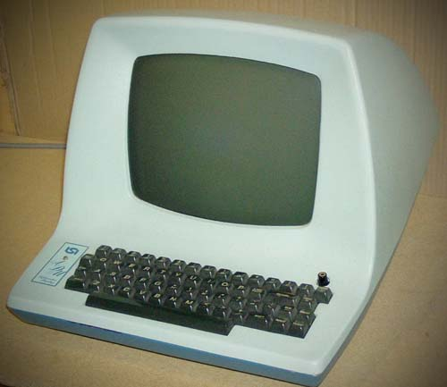

The Unix Shell
===

# What is a shell?
Nowadays, most of us interact with our computers using mice, pointers, windows, icons, etc.
This kind of graphical user interface (GUI) became widespread in the 1980s.
Once upon a time, most computers could only handle input from a keyboard and only output to a line printer.
Every interface and programming language was built upon the constraint that the input and output format was the letters, numbers, and punctuation found on a standard keyboard.
An interface based entirely on text is called a command-line interface (CLI).
CLIs run what's called a read-evaluate-print loop (REPL).
The user types a command and presses enter, the computer reads it, executes it, and prints the resulting output.
The fundamental units are text characters and lines of text, or commands.

Eventually the printers were replaced by terminals, mindless hardware devices consisting of a keyboard and a screen.
The idea was that a computer could have many terminals where a user could log in, run a series of commands, and log out.

In actuality, the terminal does not send commands directly to the computer.
There is a program in-between called a command shell.
The shell receives commands, figures out what to do with them, and passes the instructions on to the computer.
The shell is a program like any other, but it's job is to run other programs.

# Unix
Unix was originally its own operating system, but now can be thought of more as a specification or a standard.
The most popular OS based on the Unix standard is Mac OSX, followed by Linux.
These operating systems can be thought of as providing different GUIs for interacting with the same underlying core.

Unix manages a computer's file system and handles low-level operations like working with files, users and their permissions, and input-output.
Unix also includes a set of simple utility programs, and is notable for its modular philosophy, often summarized as "a program should do one thing and do it well".
To work in Unix, simple programs are pieced together to perform complex operations.
Operations that will be re-used can then be repackaged as programs in their own right.
This is an important philosophy that has influenced the development of subsequent programming languages.

Bash is the most popular Unix shell by a large margin, and it's what we'll be using.

We don't interact with out computers through terminals anymore.
When we want to use a CLI, we fire up what's called a terminal emulator, which is simply a program that functions like a terminal inside a graphical OS.
On Mac OSX the default terminal emulator is called Terminal.app; on Windows you have the command prompt.
There is not an inherent link between which terminal emulator you use and which shell you use.
If you have Windows and followed the setup instructions you installed something called Git Bash.
We'll talk about Git later, the important thing for now is that Git for Windows is packaged with a Windows version of Bash.
This includes a new shell (Bash) but not a new terminal emulator.
I highly recommend finding a better terminal emulator on Windows, so you can have multiple tabbed terminals, easier copy-paste, shortcuts, etc.
[ConEmu] is one that I've tried that seems good.
On Mac or Linux the default terminal emulator should be fine.

## Why learn the shell?
First of all, it's useful for automating tasks.
For example, imagine you have a data-analysis program that you use to process data files.
Then you have another program or script that does some master data analysis from the individual file results.
If you have hundreds of files, going through File > Open and finding each file one at a time will take forever.
A shell lets you automate this sort of repetitive process.

Another reason to use the shell is that it provides a universal interface for the operations we'll use later.
Learning how to use the shell will position you well for picking up any GUI later on.
Other times you won't be able to use a GUI at all.
In particular, if you're working remotely you may only have access to the shell.
Instead of opening up a program and clicking "Run", the process will needed to be automated.
If you ever plan to use services like the [the UConn Engineering Department's computing cluster][hpc] you will need to be comfortable in the command line.

[ConEmu]: https://code.google.com/p/conemu-maximus5/
[hpc]: http://becat.uconn.edu/hpc/
