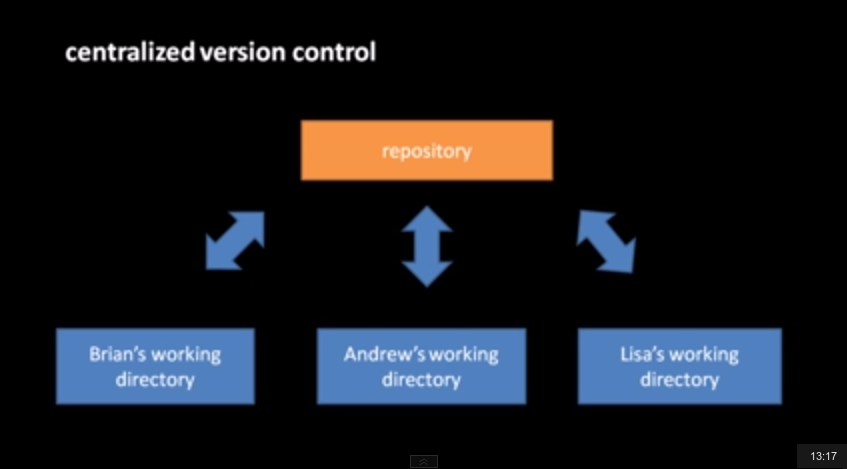
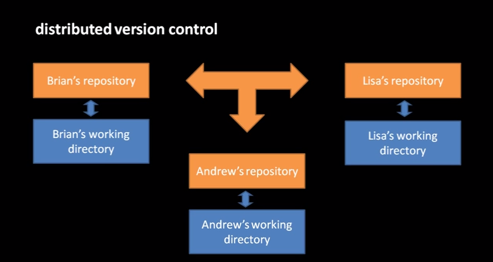
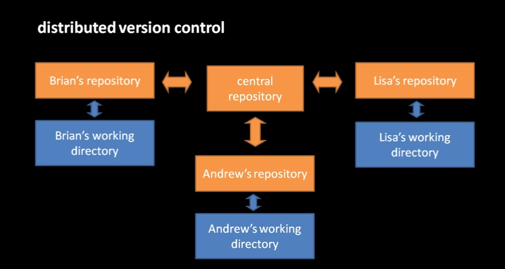
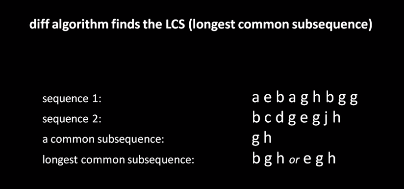
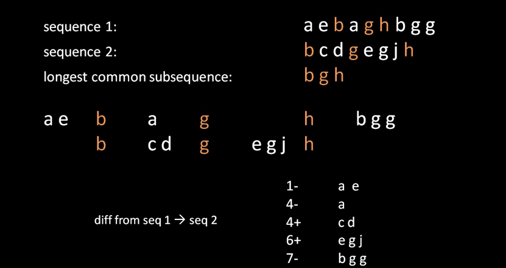
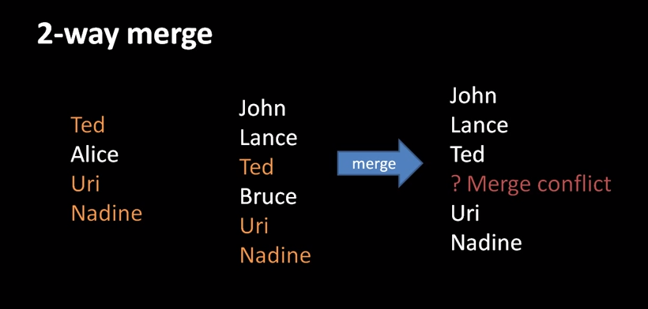
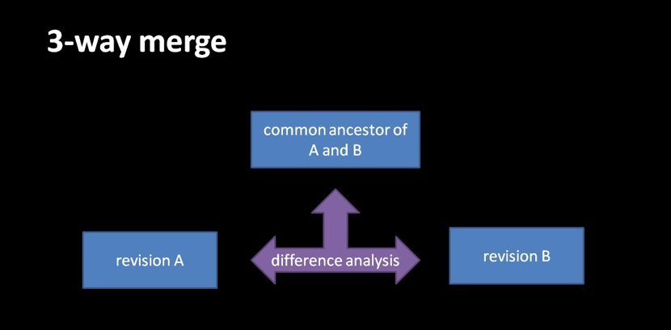

Introducing Version Control
===

*Resources I used:*

 - [software-carpentry.org](http://software-carpentry.org/v5/novice/git/index.html)
 - [hginit.com](http://hginit.com/)
 - [Brian Will's YouTube tutorial](http://www.youtube.com/playlist?list=PL0D26673135C9A407&feature=view_all)

# Why version control?

We've all seen file names like these.
It's annoying, tedious, and wastes disk space.
If you can provide a clean history of your revisions via file names, I'd be impressed.
It turns out that there's a better way.
Software developers have solved these problems (and many others) with programs called version control systems (VCS).

So what does version control do?

 - It keeps track of every old version of every file.
 - It allows you to jump back and forth to different versions without worrying about messing something up.
 - It synchronizes files in different places.
 - It can merge different versions of files, so you can work independently from your collaborators and then later combine the changes.

First some vocabulary:

 - **VCS** (version control system): software that tracks changes to files and directories.
 - **working directory**: a directory tracked by a vcs
 - **revision/version/snapshot**: a discrete state of a file or directory
 - **repository**: the store of revision history

There are two main types of VCSs, centralized and distributed.

Although we often use distributed VCS (DVCS) with some central repository.
But the central repository is no different from any of the others in principle.

The two most popular DVCS are `git` and `hg` (mercurial).
They are very similar; we'll mostly use `hg` because it's a bit simpler.
We may occasionally use `git` if we're interacting with a remote repository that is only on `git`.

There are various websites that provide services running central repositories.
The most popular is [Github](github.com).
If you're trying to popularize your open-source project, you probably need to host it on GitHub in order to give it exposure.
Another is [BitBucket](bitbucket.org).
We're using BitBucket because it is compatible with both `git` and `hg`, whereas GitHub is only compatible with `git`.
Also, BitBucket has a very generous academic policy, allowing unlimited private repositories to anyone with a `*@*.edu` email address.

How might we expect version control to work?
To explain it, I'll first explain the Unix utility `diff`.
`diff` finds the difference between two files: the set of changes you would need to make to get from one to the other.
It does this by finding the longest common subsequence (LCS) between the files.

The LCS is invariant between the files, and `diff` uses it to figure out what changes to make to get from one to the other.

We can do try it out in the shell:

    $ cd hg-lessons/diff-example
    $ diff -c before.txt after.txt
    *** before.txt	2014-05-26 18:51:04.604962950 -0400
    --- after.txt	2014-05-26 18:51:20.868962441 -0400
    ***************
    *** 1,10 ****
    - a
    - e
    - b
    - a
    - g
    - h
      b
      g
      g
      
    --- 1,9 ----
      b
    + c
    + d
      g
    + e
      g
    + j
    + h

The `-c` flag means to show the diff in "context" format, which is the format we'll see later when mercurial gives us diffs.

Our version-control systems will also have to combine files from different sources.
This is called a "merge".
It can sometimes figure out what to do, but when there are conflicts, your VCS will alert you and ask you to fix them manually.
This is what a two-way merge looks like:

If we have history, though, we can use that information to make a cleaner merge.
This is called a three-way merge, and it's what `hg` uses.

