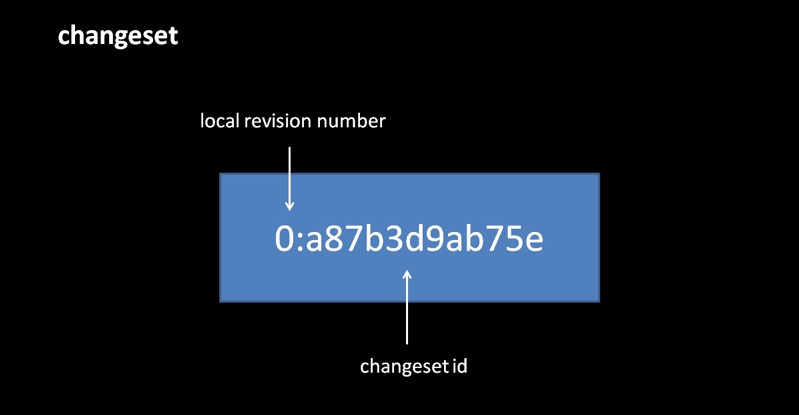
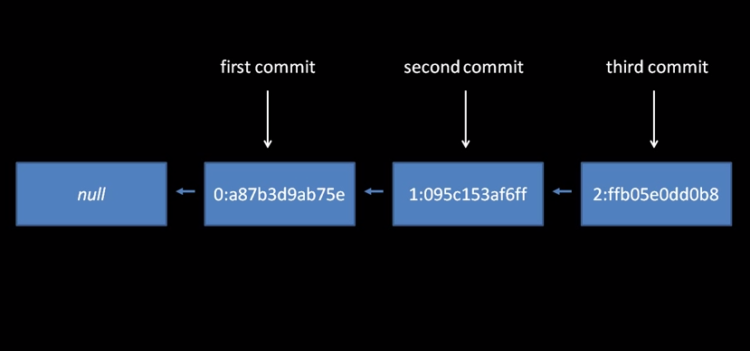
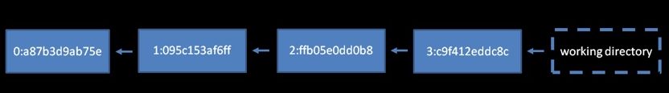

Changesets
===

A changeset is the fundamental unit of mercurial.
It basically contains the `diff` to get from the previous revision to the next.
It is often represented like this:

Changes aren't tracked automatically.
We make a changeset by performing a "commit".

Each commit points to the previous changeset, its parent.
We will see later that changesets can have more than one parent.

You can think of a the working directory as a commit-in-waiting.

When you commit, the working directory is saved and you begin working on a new commit-in-waiting.

