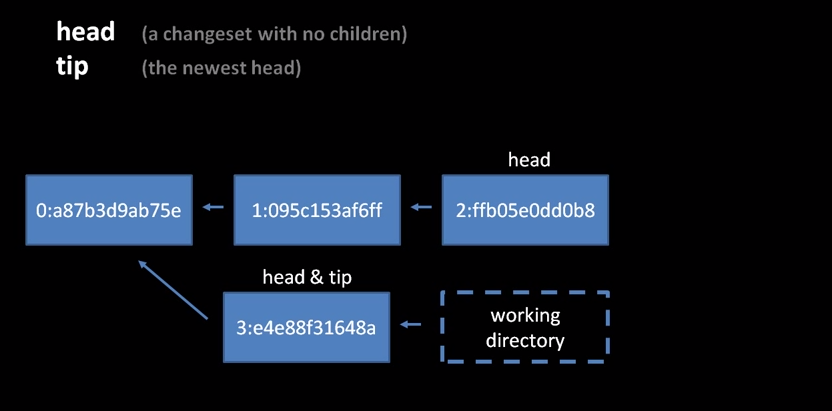

An example
===

Let's make a repository.
First we need a directory and some files.

    $ cd ~/repos
    $ mkdir hg-test
    $ cd hg-test
    $ echo "This isn't a real project" > readme.md
    $ touch data.txt
    $ ls
    data.txt  readme.md

How do we start with `hg`?
Running it with no arguments gives us a list of the most common commands.

    $ hg
    Mercurial Distributed SCM    

    basic commands:    

     add           add the specified files on the next commit
     annotate      show changeset information by line for each file
     clone         make a copy of an existing repository
     commit        commit the specified files or all outstanding changes
     diff          diff repository (or selected files)
     export        dump the header and diffs for one or more changesets
     forget        forget the specified files on the next commit
     init          create a new repository in the given directory
     log           show revision history of entire repository or files
     merge         merge working directory with another revision
     pull          pull changes from the specified source
     push          push changes to the specified destination
     remove        remove the specified files on the next commit
     serve         start stand-alone webserver
     status        show changed files in the working directory
     summary       summarize working directory state
     update        update working directory (or switch revisions)    

    use "hg help" for the full list of commands or "hg -v" for details

To turn the current directory into a mercurial repository, we run

    $ hg init

It may appear nothing happened, but if we look closely we'll find a hidden folder called `.hg`.

    $ $ ls -a
    .  ..  data.txt  .hg  readme.md

Mercurial stores the repository information in this `.hg` directory.
If we run `hg status` we can see the current state of the working directory.
This command tells us what changes are ready to be committed.

    $ hg status
    ? data.txt
    ? readme.md

We have question marks here because mercurial doesn't know what to do with these files.
It doesn't track files by default, they need to e added with the `add` command.
With no arguments, `add` adds all the untracked files.

    $ hg add
    adding data.txt
    adding readme.md
    $ hg status
    A data.txt
    A readme.md

Now these files have an `A`, meaning that they have been added since the last changeset.
Let's commit.

    $ hg commit
    abort: empty commit message

Mercurial requires a message with every commit.
It tried to open up Sublime for me to write a commit message, but since I already had Sublime running in the background it got confused.
It's possible to enter your commit message in the command line using the `-m` flag:

    $ hg commit -m 'first commit'

Now we can use `hg log` to see the history of our repository:

    $ hg log
    changeset:   0:3170a619da73
    tag:         tip
    user:        Henry Harrison <henry.schafer.harrison@gmail.com>
    date:        Mon May 26 19:24:27 2014 -0400
    summary:     first commit

Some more vocabulary:

Now let's change a file:

    $ echo 123,456 >> data.txt

`>>` is like the normal redirect `>` except it appends instead of overwriting the file.
Now if we check the status, mercurial tells us that one of the files has been modified.

    $ hg status
    M data.txt

Let's commit and keep working.

    $ hg commit -m 'add some data'
    $ echo 123,456 >> data.txt

Maybe we didn't mean to add the same data again.
We can go back with `revert`.

    $ hg revert
    abort: no files or directories specified
    (uncommitted changes, use --all to discard all changes)

`revert` wants us to tell it what files to revert.
We can use `--all` in a lot of cases.

    $ hg revert --all
    reverting data.txt

But maybe it's too late and we already committed that bad data.

    $ echo 123,456 >> data.txt
    $ hg commit -m 'add more data'
    $ hg log
    changeset:   2:80bb8a433f4f
    tag:         tip
    user:        Henry Harrison <henry.schafer.harrison@gmail.com>
    date:        Mon May 26 19:30:05 2014 -0400
    summary:     add more data    

    changeset:   1:2df2ac840158
    user:        Henry Harrison <henry.schafer.harrison@gmail.com>
    date:        Mon May 26 19:29:55 2014 -0400
    summary:     add some data    

    changeset:   0:3170a619da73
    user:        Henry Harrison <henry.schafer.harrison@gmail.com>
    date:        Mon May 26 19:24:27 2014 -0400
    summary:     first commit

We can use the `update` command to update the working directory to any revision.
Without any argument, it updates to the tip.
But we can use the `-r` flag to give it a specific revision.

    $ cat data.txt
    123,456
    123,456
    $ hg update -r 1
    1 files updated, 0 files merged, 0 files removed, 0 files unresolved
    $ cat data.txt
    123,456

Let's add the correct data and commit.
We can also use `hg diff` to see what's changed in the working directory.

    $ echo 345,789 >> data.txt
    $ hg diff
    diff --git a/data.txt b/data.txt
    --- a/data.txt
    +++ b/data.txt
    @@ -1,1 +1,2 @@
     123,456
    +345,789
    $ hg commit -m 'add correct data'
    created new head

Here mercurial is letting us know that we've created a second head in our repository.
We can see what this looks like by using the `--graph` option on the `log` command.

    $ hg log --graph
    @  changeset:   3:3eca24ce9906
    |  tag:         tip
    |  parent:      1:2df2ac840158
    |  user:        Henry Harrison <henry.schafer.harrison@gmail.com>
    |  date:        Mon May 26 19:38:19 2014 -0400
    |  summary:     add correct data
    |
    | o  changeset:   2:80bb8a433f4f
    |/   user:        Henry Harrison <henry.schafer.harrison@gmail.com>
    |    date:        Mon May 26 19:30:05 2014 -0400
    |    summary:     add more data
    |
    o  changeset:   1:2df2ac840158
    |  user:        Henry Harrison <henry.schafer.harrison@gmail.com>
    |  date:        Mon May 26 19:29:55 2014 -0400
    |  summary:     add some data
    |
    o  changeset:   0:3170a619da73
       user:        Henry Harrison <henry.schafer.harrison@gmail.com>
       date:        Mon May 26 19:24:27 2014 -0400
       summary:     first commit

This requires you to enable the "graphlog" extension.
TortoiseHG will also show you a similar graph.

Now we could either keep working off our new head, or even work on both independently and later merge them together.

